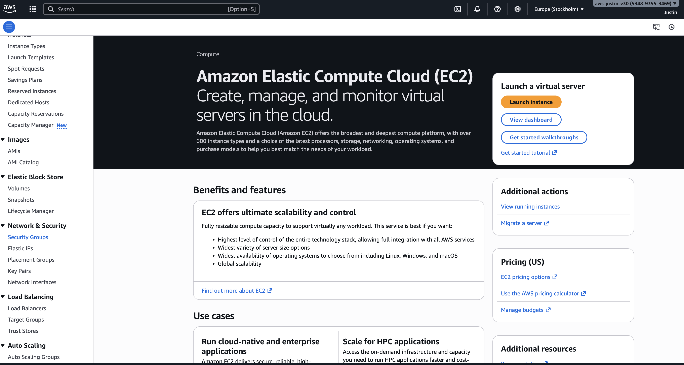
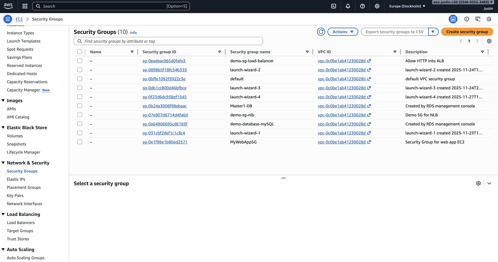
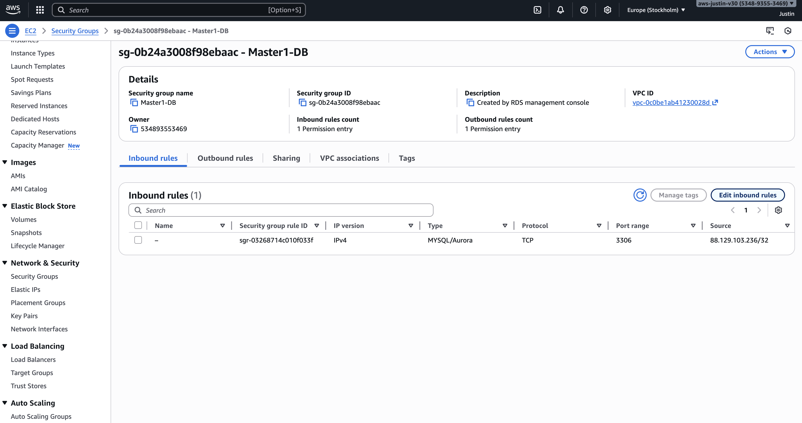
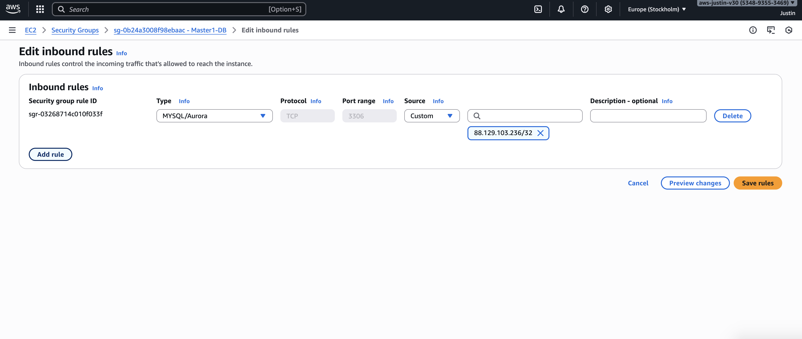
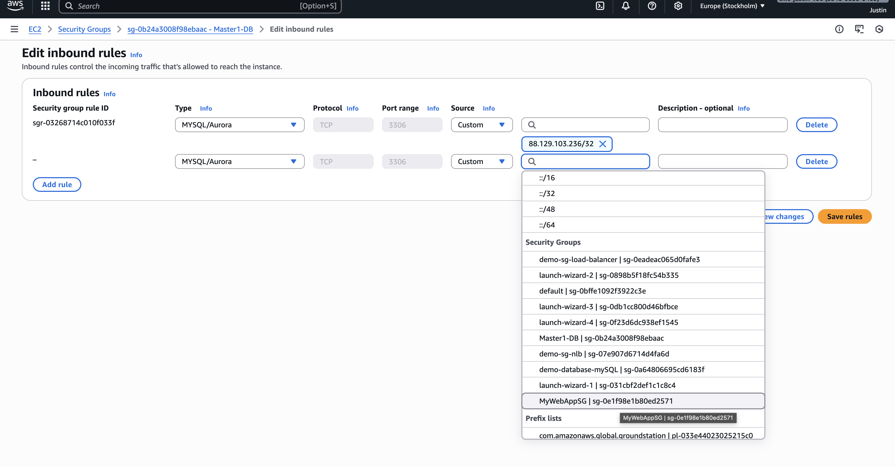
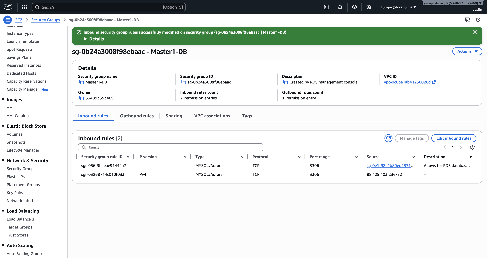

# Security Group Configuration

## Goal
Configure security groups to allow EC2 web server to communicate with RDS database.

## Steps Taken

### Step 1: Go into EC2 Console

### Step 2: Locate Security Group

### Step 3: Edit Inbound Rules

### Step 4: Add New Rule

### Step 5: Allow EC2 Conncetion

### Step 6: Rule Successfully Created

## Result
EC2 instance can now connect to RDS database on port 3306.
